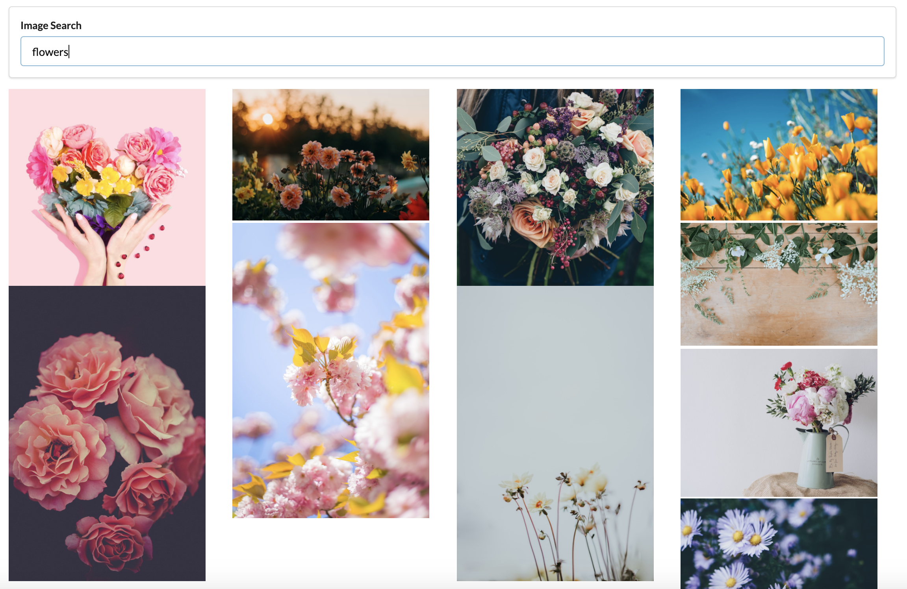
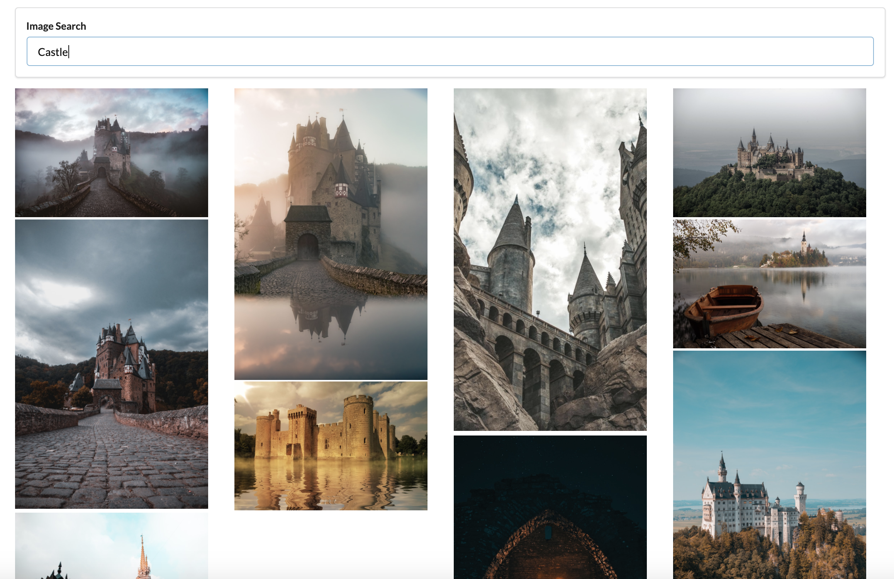
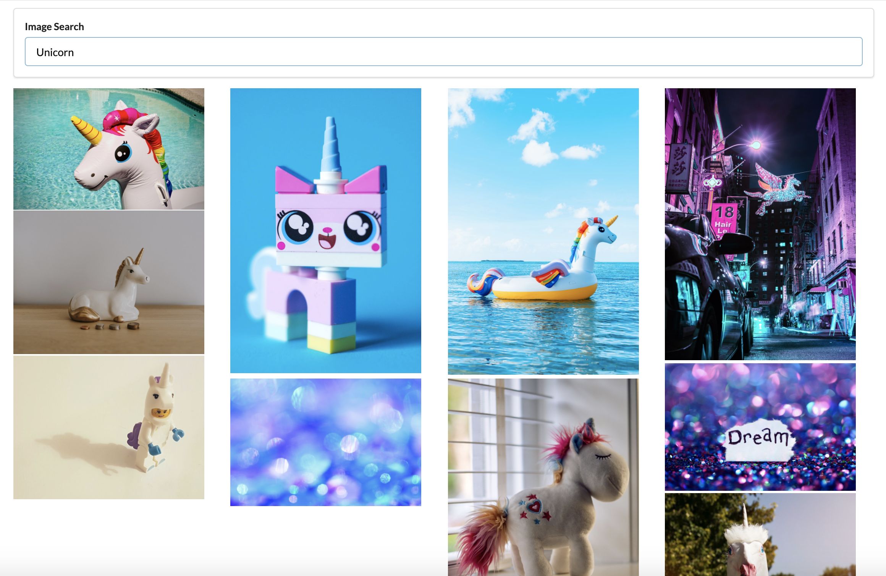

# Welcome on Gallery

This project was bootstrapped with [Create React App](https://github.com/facebook/create-react-app). It allows user to look for specific pictures. You can type some keywords in the searchbar and see a list of pics.

## End-to-end test with Cypress

## User Interface

- [x] Pick a flower picture

- [x] Pick a castle picture

- [x] Pick a pic

## Axios and unsplash API

You need to use fake data or need access to huge amount of photos. You can use [Faker](https://github.com/marak/Faker.js/) or [Unsplash](https://unsplash.com/developers).

Axios is a 3rd party package that you can use to make a request over to the unsplash API :

- axios.get( parameter1, parameter2) with parameter1, the unsplash API endpoint and parameter2, an object containing the header specifying ClientID authorization and the params specifying query strings.

## Building list of records

You can create an ItemList component. This ItemList component can be imported in the App component. 

Inside the App, we can use a property items to pass the array of items to display. The ItemList component can be a stateless functional component, which will work only with properties (props) parameter.

You can use .map() statement to do some treatments on each item of the items array :

``const images = props.images.map( (image) => {return <ImageCard key={image.id} image={image} />});``

Each time, you display a list of items you will probably have a warning message "Each child in an array or iterator should have a unique key prop". 

The key prop of each item should be an unique identifier.

The purpose of key prop find its importance in the performance of [reconciliation react algorithm](https://fr.reactjs.org/docs/reconciliation.html) to make comparison between real DOM and virtual DOM. 

## React.createRef()

You need to reach into the DOM and figure out the height of the photos. 

Instead of the use of document.querySelector('img').clientHeight, you should use React.createRef() method. It gives access to a single DOM element.

You should create refs in the constructor, assign them to instance variables, then pass to a particular JSX element as props.

It is also possible to work only with functional component and use the built-in React hook useRef().

## Use lifecycle methods

Find the example of ImageList, ImageCard or SearchBar to understand the purpose of the use of lifecycle methods. It is also possible to work only with functional components and manage the lifecycle of the component with built-in React hook like useState() and useEffect().

### constructor()

You can use the constructor() method to do one-time setup. You can set up spans value to 0 or the list of images to an empty array.

### componentDidMount()

You can use the componentDidMount() method to do data loading depending an event.

You need to figure out the height of the photo when it loads, and then set the photo height on state to get the component to rerender.

``componentDidMount () {this.imageRef.current.addEventListener('load', this.setSpans);}``

When rerendering, you have to assign a gridRowEnd to make sure the photo takes up the appropriate space.

### componentDidUpdate()

You can use the componentDidUpdate() method to do more data loading when state/props change.

### componentWillUnmount()

You can use the componentWillUnmount() method to do cleanup.

## Frequently asked questions

### How can I pass a property function from a child component to a parent component ?

You can pass a callback property from the parent App to the child component. 

In this example of SearchBar component, we pass a callback property onSubmit from the parent App component to the child SearchBar component, and the child SearchBar will call that callback to communicate with the parent App.

### How can I solve context issues such as 'Error canot read property of undefined' ?

You can bind the function inside the constructor method of the class.

You can use inline JSX arrow function. There is an example in the form of the SearchBar component:

``onChange={(e) => this.setState({ term: e.target.value })}``

You can use arrow function instead of anonymous function inside your class component. 

``onFormSubmit = (event) => {
    event.preventDefault();
    this.props.onSubmit(this.state.term);
};``

## About testing

### React-test-renderer for snapshot unit testing

Install react-test-renderer for Snpashot unit testing. Snapshots are a common theme in technology. A snapshot is like a picture of an entity at a given point in time. With snapshot testing you can take a picture of a React component and then compare the original against another snapshot later on.

### React-test-renderer & Act API for unit testing React components

If you can live with the fact that react-test-renderer does not use a DOM you'll need just to tweak the test a bit for Act. That means importing act with create.

The test must use act() for any action that changes the component's state, like "mounting" it or clicking on a function passed as a prop. 

### Use Cypress for end to end / UI testing

Install Cypress for e2e testing. End to End Testing, or UI testing is one the many approaches for testing a web application.

An end to end test checks whether a web application works as expected or not, by testing the so called user flow.

## Available Scripts

In the project directory, you can run:

### `npm start`

Runs the app in the development mode. 
Open [http://localhost:3000](http://localhost:3000) to view it in the browser.

The page will reload if you make edits. 
You will also see any lint errors in the console.

### `npm test`

Launches the test runner in the interactive watch mode. 
See the section about [running tests](https://facebook.github.io/create-react-app/docs/running-tests) for more information.

### `npm run build`

Builds the app for production to the `build` folder. 
It correctly bundles React in production mode and optimizes the build for the best performance.

The build is minified and the filenames include the hashes. 
Your app is ready to be deployed!

See the section about [deployment](https://facebook.github.io/create-react-app/docs/deployment) for more information.

### `npm run eject`

**Note: this is a one-way operation. Once you `eject`, you can’t go back!**

If you aren’t satisfied with the build tool and configuration choices, you can `eject` at any time. This command will remove the single build dependency from your project.

Instead, it will copy all the configuration files and the transitive dependencies (Webpack, Babel, ESLint, etc) right into your project so you have full control over them. All of the commands except `eject` will still work, but they will point to the copied scripts so you can tweak them. At this point you’re on your own.

You don’t have to ever use `eject`. The curated feature set is suitable for small and middle deployments, and you shouldn’t feel obligated to use this feature. However we understand that this tool wouldn’t be useful if you couldn’t customize it when you are ready for it.

## Learn More

You can learn more in the [Create React App documentation](https://facebook.github.io/create-react-app/docs/getting-started).

To learn React, check out the [React documentation](https://reactjs.org/).

### Code Splitting

This section has moved here: https://facebook.github.io/create-react-app/docs/code-splitting

### Analyzing the Bundle Size

This section has moved here: https://facebook.github.io/create-react-app/docs/analyzing-the-bundle-size

### Making a Progressive Web App

This section has moved here: https://facebook.github.io/create-react-app/docs/making-a-progressive-web-app

### Advanced Configuration

This section has moved here: https://facebook.github.io/create-react-app/docs/advanced-configuration

### Deployment

This section has moved here: https://facebook.github.io/create-react-app/docs/deployment

### `npm run build` fails to minify

This section has moved here: https://facebook.github.io/create-react-app/docs/troubleshooting#npm-run-build-fails-to-minify
